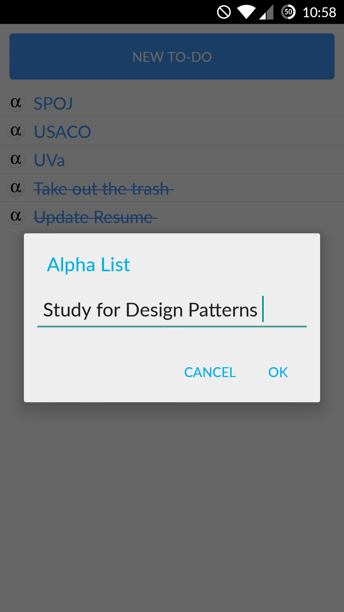

# Alpha-List
To-Do List Android Application

Simple Android application that serves as a mobile to-do list. Application allows the user to easily add, check off, and delete items from the list. A SQLite database is used to hold the list information, which is managed by a content provider. A CursorLoader is used to load the data asynchronously into the Activity. This project is partially based on an example shown in the Android Application Development course taught at the University of Florida during the Spring 2015 semester.

New Feature: Holding the New To-Do button creates a toast (quick little popup) that displays a motivational quote.

 

